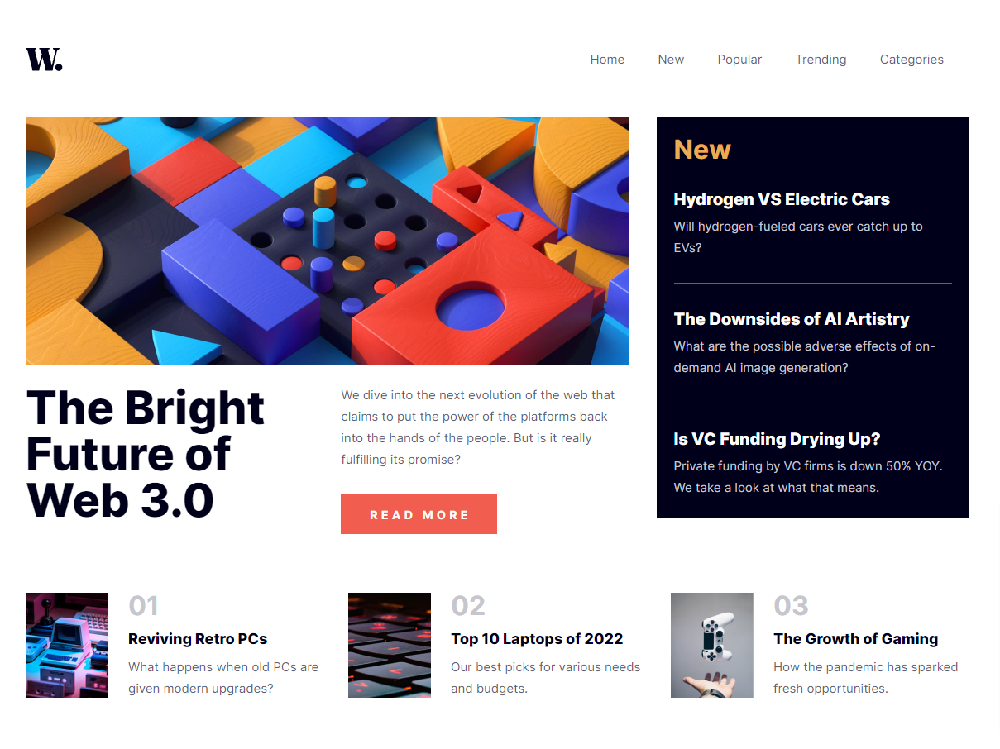

## Table of contents
- [Frontend Mentor - News Homepage](#frontend-mentor---news-homepage)
  - [Overview](#overview)
    - [The challenge](#the-challenge)
    - [Screenshot](#screenshot)
    - [Links](#links)
  - [My process](#my-process)
    - [Built with](#built-with)
    - [What I learned](#what-i-learned)
  - [Author](#author)

# Frontend Mentor - News Homepage

This is a solution to the [News Homepage](https://www.frontendmentor.io/challenges/news-homepage-H6SWTa1MFl/hub). These challenges help you improve your coding skills by building realistic projects. 
## Overview
The challenge is to build News Homepage with your own choice of language,frameworks, etc. I chose to build it using Typescript with Vitejs (you think over-engineering!)
### The challenge
The core challenge was to use CSS GRID and build the stylesheet for News homepage. This gives an opportunity to use grid beyond generic use cases
### Screenshot

### Links

- Solution URL: [View Code](https://github.com/istealersn-dev/news-homepage)
- Live Site URL: [Newsletter Form](https://newsletter-form-green.vercel.app/)

## My process
I follow some best practices for each of my projects such as:
- Assessing the project at its entirety
- Think through on how I would like to approach the build down to the molecular level
- Accessible & Performant
### Built with

- [Vite.js](https://vitejs.dev/) - Vite
Next Generation Frontend Tooling
- [Typescript](https://www.typescriptlang.org/) Typescript
- [Sass](https://sass-lang.com/) - for stylesheet

### What I learned
There are number of things I learned using Typescript:
1. HTML types where necessary thereby restricting output to HTML elements
2. CSS Grid
3. various other event listeners like resize, load, etc.
4. Building components using Typescript (similar to react)
## Author

- Frontend Mentor - [@istealersn-dev](https://www.frontendmentor.io/profile/istealersn-dev)
